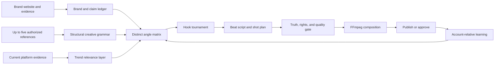

# Maya Content Engine

Research snapshot: 2026-08-01

Engine version: `2026-08-01.1`

## Decision

Maya should not be marketed or implemented as a system that guarantees
virality. It should be a continuously improving engine that raises the chance
that the right person:

1. chooses to watch or read;
2. receives the value promised by the opening;
3. decides the post is worth finishing, saving, sharing, or acting on.

That distinction is important. A static swipe file can generate loud hooks. A
content engine connects brand evidence, current audience conversations,
platform-native formats, truthful proof, production, experiments, and measured
learning.

The versioned implementation lives in
`packages/backend/convex/lib/contentEngine.ts`. Daily generation consumes it in
`packages/backend/convex/maya.ts`, while current trend evidence is refreshed by
`packages/backend/convex/trends.ts`.

## What the research supports

### Platform evidence

- YouTube tells creators to make the opening seconds deliver immediately on
  the promise made by the title and thumbnail. Its retention report exposes
  intros, top moments, spikes, and dips; it recommends moving compelling
  material earlier when the strongest moments happen late.
  [YouTube opening guidance](https://support.google.com/youtube/answer/16559650?hl=en),
  [retention guidance](https://support.google.com/youtube/answer/9314415?hl=en).
- YouTube Shorts analytics includes the percentage of viewers who chose to
  watch instead of swiping away. This is a better hook-learning signal than raw
  views alone.
  [YouTube Shorts analytics](https://support.google.com/youtube/answer/12942217?co=YOUTUBE._YTVideoType%3Dshorts&hl=en).
- TikTok's official creative guidance treats the first 3-6 seconds as the hook,
  then expects a clear key message and CTA. Other TikTok guidance calls the
  first two seconds especially valuable for ad recall.
  [TikTok hook guidance](https://ads.tiktok.com/business/creativecenter/quicktok/online/creative-tips-for-home-and-lifestyle/pc/en),
  [TikTok creative elements](https://ads.tiktok.com/business/creativecenter/quicktok/online/Power_Creative_Elements/pc/en).
- Meta recommends vertical 9:16 Reels with audio and key creative inside safe
  zones.
  [Meta Reels creative guidance](https://www.facebook.com/business/ads/facebook-instagram-reels-ads).
- Instagram Trial Reels provides the right product model for experimentation:
  show a Reel to non-followers first, inspect key metrics after roughly 24
  hours, and optionally share to followers based on performance during the
  first 72 hours.
  [Meta Trial Reels announcement](https://about.fb.com/news/2024/12/trial-reels-try-content-non-followers-first-see-what-perfoms-best/).
- Meta says messaging is Instagram's most common sharing behavior and Reels are
  reshared more than 4.5 billion times each day across Meta platforms. This is
  why Maya records a specific `whyShare` rather than merely asking for likes.
  [Meta Reels-first update](https://about.fb.com/news/2025/09/in-india-instagram-debuts-a-reels-first-experience-for-its-mobile-app/).

### Research evidence

- Berger and Milkman's field study found that practical usefulness,
  interestingness, surprise, and higher-arousal emotions were associated with
  sharing. Positive or negative valence alone is not a sufficient model.
  [What Makes Online Content Viral?](https://journals.sagepub.com/doi/abs/10.1509/jmr.10.0353).
- A later large-scale Facebook study found that models of discrete emotions
  explain sharing better than reducing emotion to simple positive/negative
  valence and arousal. This argues for designing the intended viewer response
  precisely, not adding generic "emotion."
  [Discrete emotions and sharing](https://pmc.ncbi.nlm.nih.gov/articles/PMC10541009/).
- Information-gap theory explains curiosity as attention to a recognized gap
  between what someone knows and wants to know. Maya therefore allows bounded
  open loops but requires the next beat to begin paying them off.
  [The Psychology of Curiosity](https://cir.nii.ac.jp/crid/1360855568766034816).

These findings are mechanisms and evaluation hypotheses, not a promise that a
particular post will go viral.

### Prompt and video-generation evidence

Public prompt galleries are useful for learning the vocabulary of a shot, but
they are weak as a content strategy. Strong current model guidance converges on
clear subject action, setting, camera, composition, light, motion, and
continuity:

- Google's Veo prompt guide recommends specifying subject, action, style,
  camera, composition, focus, and ambience, and Veo 3.1 supports portrait 9:16
  output, reference images, first/last frames, and extensions.
  [Google Veo guide](https://ai.google.dev/gemini-api/docs/video?authuser=01).
- Runway recommends simple, direct, positive descriptions of observable motion,
  with image-to-video prompts focused on what should move.
  [Runway Gen-4 guide](https://help.runwayml.com/hc/en-us/articles/39789879462419-Gen-4-Video-Prompting-Guide),
  [image-to-video guide](https://help.runwayml.com/hc/en-us/articles/48324313115155-Image-to-Video-Prompting-Guide).
- PromptHero's current guide similarly decomposes a video prompt into subject
  action, camera, lighting, and ending. Its gallery is useful as inspiration,
  but its wording is never treated as brand evidence.
  [PromptHero video guide](https://prompthero.com/blog/text-to-film-ai-video-prompts),
  [video prompt gallery](https://prompthero.com/video-prompts?sort=top).
- VidProM is a large research dataset of real text-to-video prompts. It is
  useful evidence that public prompting styles can be studied at scale, not a
  license to copy individual creative work.
  [VidProM paper](https://arxiv.org/abs/2403.06098).

## The engine

The library has three layers:

- **Durable mechanisms:** 12 hook families and 8 short-form structures. These
  change slowly.
- **Current relevance:** evidence-dated platform topics, sounds, conversations,
  and formats. These expire quickly and are never allowed to replace audience
  relevance.
- **Brand truth:** the user's audience, offer, real proof, voice, rights, and
  constraints. This is the final authority.

### Hook families

Maya chooses one primary mechanism per candidate:

1. pain mirror;
2. outcome first;
3. proof first;
4. visual demonstration;
5. contrarian correction;
6. mistake diagnosis;
7. bounded open loop;
8. identity relevance;
9. sequence preview;
10. story in motion;
11. comparison test;
12. objection test.

Each family has a formula and a guardrail in code. Formulas are scaffolds, not
phrases to repeat verbatim.

### Content formats

The current format library includes proof demo, problem/solution,
before/after, three-beat education, story turn, comparison test, comment
response, and behind-the-scenes process. Each format defines its required story
beats and legitimate retention devices.

### Versioned prompt recipes

`CONTENT_PROMPT_RECIPES` contains nine composable stages:

1. brand grounding;
2. five-reference deconstruction;
3. angle matrix;
4. hook tournament;
5. beat script;
6. shot generator;
7. caption packager;
8. truth and rights red-team;
9. performance learning.

The generation path can combine some stages to reduce cost, but research
artifacts should be persisted and reused rather than rediscovered for every
post.

## Website plus five-reference workflow

For a website and up to five template videos or posts:

1. Crawl only approved website pages and store the source URL beside each
   material brand claim.
2. Record rights status for each supplied reference: user-owned, licensed for
   reuse, or reference-only.
3. Extract the first frame, first spoken line, hook mechanism, timed beats, cut
   rhythm, caption density, safe-zone use, audio role, proof device, CTA type,
   and trend-dependent elements.
4. Normalize the five examples into a structural grammar. Do not average them
   into one bland template.
5. Explicitly list what may not be copied: exact wording, a creator's likeness,
   licensed music, and signature visual sequences.
6. Generate distinct angle candidates from the brand evidence and current
   audience conversations.
7. Run a hook tournament, then produce a timed beat/shot manifest.
8. Pass the result through claim, rights, accessibility, and hook-payoff gates
   before rendering.

Supplying a public URL is not evidence that the media may be downloaded,
reposted, or used to imitate a creator. Reference-only assets should be
analyzed structurally and never passed into the final FFmpeg render.

## Quality gate

Every generated candidate now records:

- engine version;
- hook family and content format;
- exact opening visual;
- ordered content beats;
- retention devices;
- hook payoff;
- reason a specific viewer would share;
- claim-safety class;
- CTA type;
- deterministic quality score and issues.

The deterministic audit does **not** claim to predict virality. It blocks
unfilled placeholders, hollow hype, and unverified claims, then checks useful
structure. Semantic similarity checks continue to reject "same idea, different
words" against recent Maya decks.

## Learning loop

The prompt library should be updated from controlled evidence:

- Compare a post to the same account's recent baseline and similar formats.
- Diagnose topic, hook, execution, distribution, and CTA separately.
- Use platform-native metrics: chose-to-view or swipe-away, early retention,
  average watch percentage, rewatches, qualified saves/shares, comments, and
  conversion action.
- Store engine version, hook family, format, duration, platform, sample size,
  and rights/claim status with the outcome.
- Recommend one controlled next test. Do not rewrite an evergreen mechanism
  because one temporary meme spiked.

Suggested cadence:

- trend evidence: daily, with a short expiry;
- account learning: after each post reaches a useful observation window;
- mechanism and prompt review: monthly;
- research and platform-policy review: quarterly or after a material platform
  change.

## Current implementation boundary

Implemented and locally checked:

- versioned hook and format library;
- trend-ranked creator-template catalogue shared by Studio and Maya;
- one-click starter briefs and production directions for current video formats;
- nine reusable prompt recipes;
- evidence-oriented trend-discovery prompt;
- structured creative plan persisted with each Maya suggestion;
- quality blocking and ranking before insertion;
- semantic duplicate protection already present in Maya.

Still required for the complete product:

- a website/reference ingestion UI and durable evidence/rights records;
- source-specific frame/audio transcription for the five references;
- publishing connectors and platform analytics ingestion;
- an experiment dashboard that compares like-for-like posts;
- periodic human review of claims, rights, and prompt-library changes.
