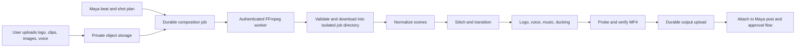

# MagicBox Video Composition Engine

Assessment date: 2026-07-31

## Verdict

The requested capability is available locally now:

- normalize and stitch multiple video clips and still images;
- trim clips and set still-image duration;
- use hard cuts or short fades, wipes, and slides;
- place a logo in seven positions with configurable size, margin, and opacity;
- add a supplied voice track;
- add optional music and duck it under the voice;
- render a vertical or custom-size H.264/AAC MP4;
- verify the final dimensions, codecs, audio stream, and duration.

A real integration test composes a two-scene vertical video with a transition,
logo, and user voice, then probes the resulting MP4. This proves the editing
core, but it does **not** mean the feature is production-live. Durable object
storage, a deployed worker, job state, quotas, and the UI handoff remain.

The implementation is in `apps/renderer/src/ffmpeg`. The authenticated API is
`POST /api/compose`; the Convex entry point is
`packages/backend/convex/video.ts:startCompositionRender`.

## Existing-system audit

There were two different rendering paths:

- `functions/src/index.ts:renderRemotionVideo` writes a Remotion-project JSON
  document to Firebase Storage and returns that JSON URL as `videoUrl`. It does
  not render a video and must not be used as proof of MP4 generation.
- `apps/renderer/src/index.js:/api/render` uses Remotion's real
  `renderMedia()` renderer and writes a local MP4, but does not upload it to
  durable storage.

The new FFmpeg path performs real media composition and returns verified media
metadata. Its worker URL is still explicitly marked `durable: false`.

## Framework decision

| Option | Strengths | Risks and fit | Decision |
| --- | --- | --- | --- |
| Direct FFmpeg CLI from Node | Mature media engine; precise filters; no wrapper lag; existing JS service can invoke argument arrays safely | Filter graphs require engineering discipline; codec build and license choices matter | **Selected for asset composition** |
| Remotion | Excellent React-authored motion graphics and current renderer API | Current licensing says prompt-to-video and automated rendering are “Automators”; pricing applies per render with a monthly minimum, and companies of four or more need a company license | Retain for authored templates only after commercial review |
| Editly | MIT, Node/FFmpeg, declarative clips, transitions, captions, picture-in-picture, and audio ducking | Additional abstraction and maintenance dependency; less control than the product needs | Useful reference, not the core |
| MoviePy | MIT, flexible Python compositing API | Introduces a Python service and is less direct for a Node/FFmpeg worker | Not selected |
| MLT | Mature broadcast/NLE framework with multitrack concepts | Native-framework complexity is excessive for the initial service | Revisit only for timeline-editor requirements |
| fluent-ffmpeg | Familiar historical Node wrapper | Repository was archived and deprecated in 2025 | Do not adopt |

Primary sources:

- [FFmpeg overview](https://www.ffmpeg.org/about.html) and
  [filter documentation](https://www.ffmpeg.org/ffmpeg-filters.html)
- [FFmpeg licensing and build guidance](https://ffmpeg.org/legal.html)
- [Remotion renderMedia API](https://www.remotion.dev/docs/renderer/render-media)
  and [current license/pricing](https://www.remotion.dev/docs/license/pricing)
- [Editly repository](https://github.com/mifi/editly)
- [MoviePy repository](https://github.com/zulko/moviepy) and
  [compositing guide](https://zulko.github.io/moviepy/user_guide/compositing.html)
- [MLT framework documentation](https://www.mltframework.org/docs/framework/)
- [archived fluent-ffmpeg repository](https://github.com/fluent-ffmpeg/node-fluent-ffmpeg)

FFmpeg's filters directly cover the required primitives: `overlay` for the
logo, `concat` and `xfade` for cuts/transitions, `amix` for voice/music mixing,
and `sidechaincompress` for ducking. The pipeline first normalizes every scene
to the same dimensions, frame rate, pixel format, sample aspect ratio, and time
base because concat/xfade require compatible inputs.

## Composition contract

The renderer accepts declarative, replayable JSON:

```json
{
  "output": {
    "width": 1080,
    "height": 1920,
    "fps": 30,
    "crf": 20,
    "preset": "veryfast"
  },
  "scenes": [
    {
      "source": "https://media.example.com/opening.mp4",
      "kind": "video",
      "trimStart": 0.5,
      "duration": 3.5,
      "fit": "cover",
      "transitionToNext": { "type": "fade", "duration": 0.25 }
    },
    {
      "source": "https://media.example.com/product.jpg",
      "kind": "image",
      "duration": 2.5,
      "fit": "contain",
      "motion": "slow-zoom"
    }
  ],
  "logo": {
    "source": "https://media.example.com/logo.png",
    "position": "top-right",
    "widthRatio": 0.18,
    "opacity": 0.92,
    "margin": 48
  },
  "audio": {
    "voice": {
      "source": "https://media.example.com/voice.wav",
      "volume": 1
    },
    "music": {
      "source": "https://media.example.com/licensed-music.mp3",
      "volume": 0.18,
      "loop": true
    },
    "duckMusicUnderVoice": true
  }
}
```

Supported transitions are `cut`, `fade`, `fadeblack`, `wipeleft`,
`wiperight`, and `slideleft`. Logo positions are `top-left`, `top-center`,
`top-right`, `center`, `bottom-left`, `bottom-center`, and `bottom-right`.

The manifest is intentionally restricted. Arbitrary FFmpeg flags or filter
expressions are never accepted from an API caller.

## Integration architecture



Production sequence:

1. Upload assets directly to private object storage with content-type and size
   restrictions.
2. Create a durable job containing the versioned composition manifest, asset
   IDs, user ID, and idempotency key.
3. Give the worker short-lived signed read URLs; do not expose arbitrary URLs
   where a storage asset ID will do.
4. Download into an isolated job directory and run the validated pipeline.
5. Probe the MP4 and upload it to durable output storage.
6. Store output metadata and a durable asset ID before marking the job
   complete.
7. Attach the asset to the Maya suggestion/post approval flow.

## Security and operational controls already implemented

- production bearer token required for `/api/compose`;
- credential-free HTTPS only at the remote API boundary;
- asset-host allowlist required in production;
- DNS and private-address checks on every redirect;
- MIME-role validation and per-role byte limits;
- three-redirect and 30-second download limits;
- isolated input and FFmpeg work directories;
- local-path containment before FFmpeg access;
- argument-array process invocation with no shell interpolation;
- 30-scene and 180-second composition limits;
- fixed output codecs and bounded dimensions, frame rates, presets, and CRF.

## Production gates

Before calling the feature production-ready:

- deploy a pinned, reproducible FFmpeg container;
- upload output to durable object storage and return an asset ID, not an
  ephemeral worker URL;
- add queued/running/completed/failed/cancelled job state, progress, retries,
  idempotency, and timeouts;
- enforce per-user concurrency, compute quotas, output retention, and cleanup;
- use short-lived signed input/output URLs and private output authorization;
- record music, stock asset, logo, voice, and reference rights;
- add captions/subtitle burn-in and safe-zone presets where the post requires
  them;
- connect the manifest builder to Maya's approved beat plan and asset picker;
- load-test long inputs and simultaneous jobs;
- complete codec, patent, FFmpeg-build, and Remotion-license review.

The locally installed FFmpeg build is GPL-enabled and includes `libx264`.
FFmpeg's own legal page explains that license obligations depend on the build
configuration. Production should pin only the components MagicBox needs and
have counsel review codec/patent and distribution obligations.

## Verification

Run:

```bash
cd apps/renderer
npm test
```

The integration test generates its own source clip, still image, transparent
logo, and voice tone; invokes the same composer used by the endpoint; and
asserts:

- 360 x 640 output;
- H.264 video;
- AAC audio;
- two scenes;
- expected duration range.

Backend schema and action integration are checked with:

```bash
cd packages/backend
npm run typecheck
```
